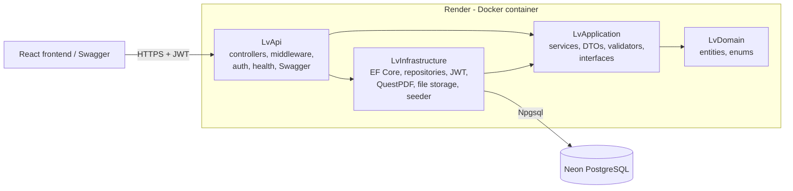
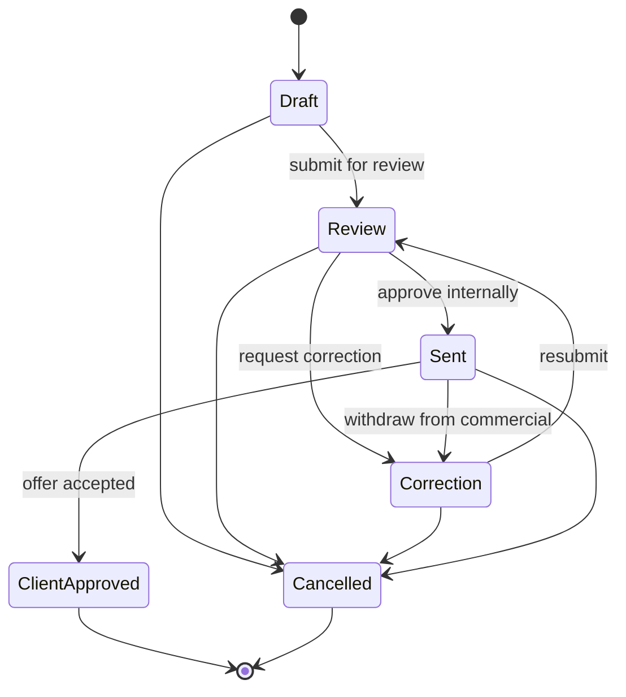
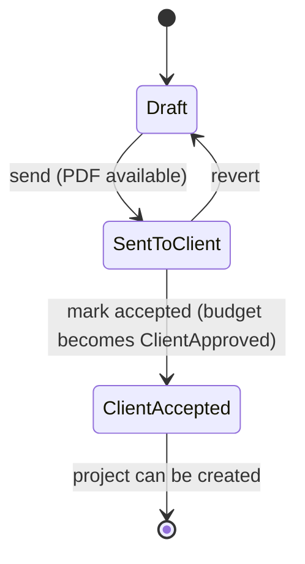
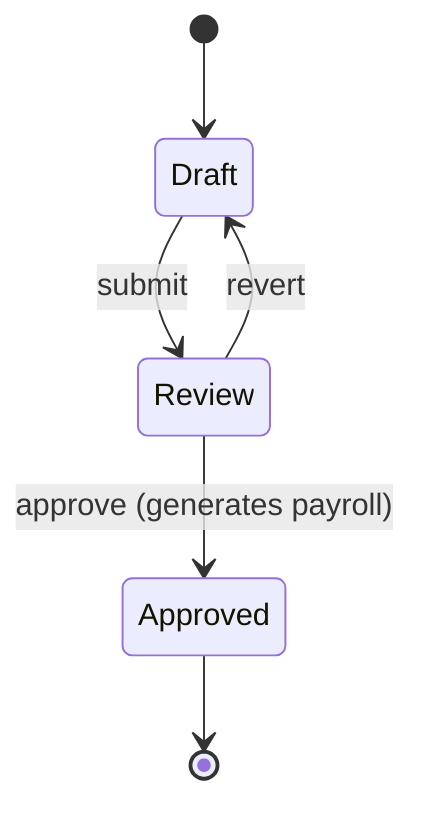
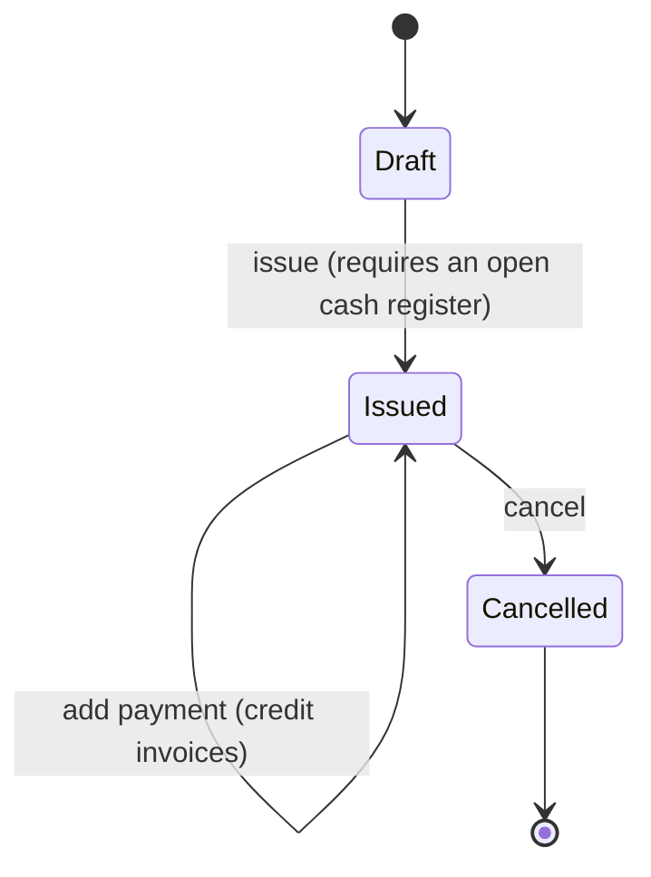

# LvBuild API

[](https://github.com/LSvargas25/LvBuild/actions/workflows/ci.yml)


Backend for **LV Construcciones**, a Costa Rican construction company: budgets, client offers
(PDF), projects, weekly site logs, payroll, warehouse, and a hardware store with cash registers
and invoices. ASP.NET Core 8, EF Core 9 on PostgreSQL, layered architecture, JWT auth.

> **Resumen en español.** API del sistema de gestión de LV Construcciones: presupuestos,
> ofertas en PDF, proyectos, bitácoras semanales, planillas, bodega y tienda (cajas y
> facturación). .NET 8 + PostgreSQL (Neon), desplegable en Render con Docker. Incluye una empresa
> demo con datos realistas, health checks, Swagger y CI con tests contra PostgreSQL real.
> Para correrlo: `cp .env.example .env` y `docker compose up --build`. Las credenciales demo
> están abajo.

## Live demo

- **App:** https://lvbuild-web.onrender.com (frontend: [lvbuild-web](https://github.com/LSvargas25/lvbuild-web))
- **API:** https://lvbuild-api.onrender.com
- **Swagger:** https://lvbuild-api.onrender.com/swagger
- **Health:** https://lvbuild-api.onrender.com/health/ready (database) and `/health` (liveness)

The free Render instance sleeps when idle, and Neon suspends idle compute: the first request
can take 30-60 seconds.

### Demo credentials

All demo users share the password **`LvBuild#2026`** (demo data only, `Seed__Demo=true`).

| Email                      | Role               |
|----------------------------|--------------------|
| `gerencia@lvbuild.test`    | GeneralManager     |
| `operaciones@lvbuild.test` | OperationsDirector |
| `proyectos@lvbuild.test`   | ProjectAdmin       |
| `sucursal@lvbuild.test`    | BranchAdmin        |
| `comercial@lvbuild.test`   | BusinessManager    |

In Swagger, call `POST /api/auth/login` with one of the accounts, copy `accessToken`, click
**Authorize** and paste it. Then try `GET /api/projects` and
`GET /api/projects/{id}/finance` to see budget vs. actual for the active demo project.

## Architecture



Dependencies point inwards. The domain knows nothing about ASP.NET Core or EF Core, and
infrastructure details sit behind interfaces declared in `LvApplication`
([ADR 0003](docs/adr/0003-clean-architecture.md)).

## Modules

| Module                | What it covers                                                            |
|-----------------------|---------------------------------------------------------------------------|
| Auth & users          | JWT login, refresh, password reset, roles, profile photos                 |
| Branches              | Company branches and their staff                                          |
| Customers / Suppliers | Commercial contacts                                                       |
| Workers               | Site workers and their rates                                              |
| Budgets               | Chapters and line items, internal review, client approval, status history |
| Offers                | Client offer built from a budget, PDF generated on demand                 |
| Projects              | Project created from an accepted offer; finance view (budget vs. actual)  |
| Site logs & payroll   | Weekly site log; approving it generates the payroll                       |
| Incidents             | Unplanned costs charged to a project                                      |
| Warehouse & materials | Stock movements and material tickets charged to projects                  |
| Store (commercial)    | Products, stock, cash registers, invoices (cash/credit) and payments      |
| Notifications         | In-app notifications for workflow events                                  |

## State flows

**Budget (Presupuesto)**



**Offer (Oferta)**: created from a budget in `Sent`.



**Weekly site log (Bitácora)**



**Invoice (Factura)**



## Technical decisions

- **PostgreSQL on Neon** instead of SQL Server: free managed tier, and the same engine locally
  and in CI ([ADR 0001](docs/adr/0001-postgresql.md)).
- **No files on disk**: offer PDFs are rendered in memory on each request, and profile photos are
  stored in PostgreSQL behind `IFileStorageService`, because Render's disk is wiped on every
  deploy ([ADR 0002](docs/adr/0002-file-storage.md)).
- **Layered architecture** with the business rules in application services
  ([ADR 0003](docs/adr/0003-clean-architecture.md)).
- **Configuration validated at startup** (`ValidateOnStart`): the app refuses to start with
  missing or invalid settings and names the variable to fix.
- **Health checks**: `/health` for liveness (used by Render) and `/health/ready` with an EF Core
  database check.
- **Migrations on startup are opt-in** (`Database__MigrateOnStartup=true`), because Render's free
  plan has no pre-deploy hook.
- **Idempotent demo seeder** that goes through the real application services, so totals, stock
  and project costs follow production rules.
- **Behind a proxy**: with `ReverseProxy__Enabled=true`, forwarded headers are trusted and HTTPS
  is left to Render. The container runs as a non-root user and listens on `PORT`.
- **Quality gates**: zero analyzer warnings (`TreatWarningsAsErrors` in CI), CSharpier
  formatting, Central Package Management, and a coverage report in the CI summary.

## Running locally

### With Docker Compose (PostgreSQL + API)

```bash
cp .env.example .env     # set POSTGRES_PASSWORD and JWT_KEY
docker compose up --build
```

- Swagger: <http://localhost:8080/swagger>
- Health: <http://localhost:8080/health/ready>

The schema is migrated and the demo company is loaded on startup.

### With the .NET SDK

Requires the .NET SDK 9.0.200 or later (for the `.slnx` solution) plus the .NET 8 runtime
(projects target `net8.0`), and a PostgreSQL database. See
[docs/development.md](docs/development.md) for user-secrets, migrations and PostgreSQL
conventions.

```bash
dotnet run --project LvApi
```

### Configuration

All settings come from environment variables, documented in [.env.example](.env.example).

| Variable                               | Required | Purpose                                 |
|----------------------------------------|----------|-----------------------------------------|
| `ConnectionStrings__DefaultConnection` | yes      | PostgreSQL connection string            |
| `Jwt__Key`                             | yes      | JWT signing key, at least 32 characters |
| `Jwt__Issuer`, `Jwt__Audience`         | yes      | JWT issuer and audience                 |
| `Cors__AllowedOrigins__0..n`           | no       | Frontend origins allowed by CORS        |
| `Database__MigrateOnStartup`           | no       | Apply pending migrations on startup     |
| `Seed__Demo`                           | no       | Load the demo company (idempotent)      |
| `Swagger__Enabled`                     | no       | Serve Swagger UI outside Development    |
| `ReverseProxy__Enabled`                | no       | Trust `X-Forwarded-*` headers (Render)  |

## Tests

```bash
dotnet test
```

- **Unit** (`LvTest/Services`): application services on EF Core InMemory.
- **HTTP** (`LvTest/Http`): the real pipeline through `WebApplicationFactory`.
- **Integration** (`LvTest/Integration`): real PostgreSQL 16 through Testcontainers, with the
  real migrations. **Docker must be running.**

Without Docker:

```bash
dotnet test --filter "FullyQualifiedName!~LvTest.Integration"
```

CI publishes the test counts and the coverage summary in each run's job summary, and builds and
smoke-tests the Docker image against PostgreSQL.

## Deployment (Render + Neon)

1. Create a Neon project and copy the **pooled** connection string (add `SSL Mode=Require`).
2. In Render, choose **New > Blueprint** and select this repository. [render.yaml](render.yaml)
   creates the Docker web service on the free plan and generates `Jwt__Key`.
3. Fill in the secrets Render asks for: `ConnectionStrings__DefaultConnection` and
   `Cors__AllowedOrigins__0` (the frontend URL).
4. The first deploy migrates the schema and loads the demo data. Set `Seed__Demo=false` for a
   database without demo data.
